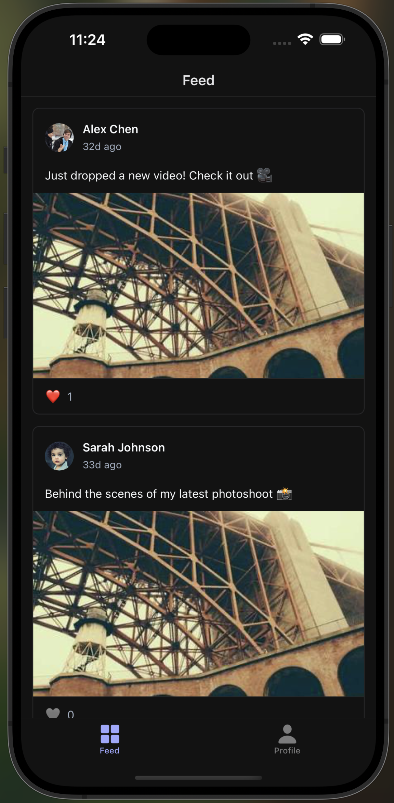

# Post Feed - React Native Coding Exercise



## Overview

Build a working post feed with infinite scrolling and like functionality using React Native Web (running in CodeSandbox), Expo, and **your choice of data fetching approach**.

**Environment:** This exercise runs in CodeSandbox using React Native Web. The app runs in your browser, not on a mobile device.

**Time Limit:** 45-50 minutes

## Choose Your Approach

This exercise offers two implementation paths. Choose the one you're most comfortable with:

### Option A: GraphQL + Apollo Client
- Use GraphQL queries and mutations
- Leverage Apollo Client's built-in caching and optimistic updates
- Familiar GraphQL syntax and Apollo hooks

### Option B: REST + TanStack Query
- Use REST API endpoints
- Leverage TanStack Query's powerful caching and infinite query features
- Familiar REST patterns with modern React Query hooks

**Both approaches solve the same problem and are evaluated equally.** Choose based on your experience and preference.

## Getting Started

This exercise runs in **CodeSandbox** using **React Native Web**. The CodeSandbox environment is pre-configured, so you can start coding immediately.

The app will run in your browser. You don't need to install anything locally or start a development server.

## What You Need to Implement

### 1. Fetch Posts (`app/(tabs)/index.tsx`)

**Option A (GraphQL + Apollo):**
- Implement a GraphQL query to fetch posts
- Set up the `useQuery` hook from Apollo Client
- Extract the posts data and handle loading/error states

**Option B (REST + TanStack Query):**
- Set up the `useInfiniteQuery` hook from TanStack Query
- Create a fetch function that calls the REST API
- Extract the posts data and handle loading/error states

### 2. Implement Pagination (`app/(tabs)/index.tsx`)

**Option A (GraphQL + Apollo):**
- Use `fetchMore` to load additional posts as the user scrolls
- Handle pagination parameters (offset/limit) correctly

**Option B (REST + TanStack Query):**
- Use `fetchNextPage` to load additional posts as the user scrolls
- Configure `getNextPageParam` to determine when more data is available

### 3. Render the Feed (`app/(tabs)/index.tsx`)

Replace the placeholder with a FlatList that:
- Displays posts using the `PostCard` component
- Handles infinite scrolling pagination
- Shows appropriate loading/error states

**Note:** Pull-to-refresh is not available in React Native Web. Focus on implementing infinite scroll pagination instead.

### 4. Add Like/Unlike Functionality (`components/post-card.tsx`)

**Option A (GraphQL + Apollo):**
- Implement `likePost` and `unlikePost` mutations
- Use `useMutation` hooks with optimistic updates
- Update the Apollo cache appropriately

**Option B (REST + TanStack Query):**
- Implement `useMutation` hooks for like/unlike API calls
- Use `onMutate` for optimistic updates
- Handle cache updates and rollback on error

## API Documentation

### Option A: GraphQL API

All queries and mutations are available at `/api/graphql`:

```graphql
type Post {
  id: ID!
  creatorName: String!
  creatorAvatar: String!
  content: String!
  imageUrl: String
  likes: Int!
  timestamp: String!
  isLiked: Boolean!
}

type Query {
  posts(offset: Int, limit: Int): [Post!]!
}

type Mutation {
  likePost(id: ID!): Post
  unlikePost(id: ID!): Post
}
```

### Option B: REST API

All endpoints are available at `/api/posts`:

**GET `/api/posts?offset=0&limit=20`**
- Returns an array of posts
- Query parameters:
  - `offset` (optional, default: 0): Starting index for pagination
  - `limit` (optional, default: 20): Number of posts to return
- Response: `Post[]`

**POST `/api/posts/:id/like`**
- Likes a post with the given ID
- Returns the updated post
- Response: `Post`

**POST `/api/posts/:id/unlike`**
- Unlikes a post with the given ID
- Returns the updated post
- Response: `Post`

**Post Type:**
```typescript
interface Post {
  id: string
  creatorName: string
  creatorAvatar: string
  content: string
  imageUrl: string | null
  likes: number
  timestamp: string
  isLiked: boolean
}
```

## Important Notes

- **Environment:** This exercise runs in CodeSandbox using React Native Web. The app runs in your browser, not on a mobile device.
- **Pull-to-Refresh:** Not available in React Native Web. Focus on infinite scroll pagination instead.
- **Mutations:** Have network delays that should be handled appropriately (optimistic updates recommended)
- **Test Data:** 500 mock posts are available for testing pagination
- **API Consistency:** Both API approaches use the same underlying data source and have identical delay behavior

## What's Already Built

- **CodeSandbox Environment:** Pre-configured for React Native Web
- **Option A:** Apollo Client setup with cache configured for pagination
- **Option B:** TanStack Query client with sensible defaults
- Both providers are set up in the root layout
- GraphQL server with resolvers (Option A)
- REST API endpoints (Option B)
- Complete UI components and styling
- Loading/error states
- Performance optimizations

## Success Criteria

1. Posts load and display correctly
2. Infinite scroll loads more posts
3. Like button updates instantly (optimistic updates)
4. Code is clean and follows best practices for your chosen approach
5. Error states are handled gracefully

## Bonus: Performance Improvements (Optional)

If you complete the main exercise early and have time remaining within the 45-50 minute limit, identify and implement performance optimizations. Look for opportunities to improve rendering performance, reduce unnecessary computations, and prevent race conditions.

### Areas to Consider

- **Component Re-renders**: Are components re-rendering unnecessarily when parent state changes? Consider React's memoization patterns to prevent re-renders when props haven't changed.
- **Expensive Computations**: Are there calculations that run on every render but could be optimized? Look for functions that process data but only depend on specific props.
- **List Performance**: Are there optimizations that could improve FlatList rendering performance? Consider memoizing callbacks passed to FlatList to prevent unnecessary item re-renders.
- **User Interactions**: Are there edge cases with rapid user interactions that should be handled? Think about preventing duplicate mutations when users click buttons quickly.

### Success Criteria for Bonus

1. ✅ Unnecessary component re-renders are minimized
2. ✅ Expensive computations are optimized
3. ✅ List rendering performance is improved
4. ✅ Rapid user interactions are handled gracefully
5. ✅ Performance improvements are measurable (smoother scrolling, fewer re-renders)

### Testing Performance Improvements

- Use React DevTools Profiler to verify fewer re-renders
- Test scrolling performance with 100+ posts
- Verify that rapid interactions don't cause issues
- Verify that optimizations reduce unnecessary work

## Questions?

Ask your interviewer if you need clarification on any requirements.
